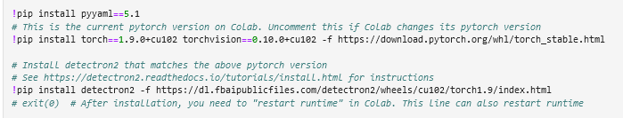
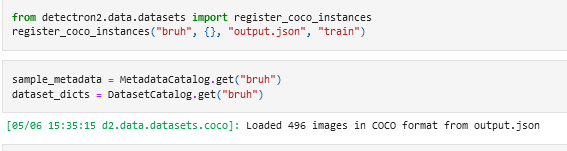
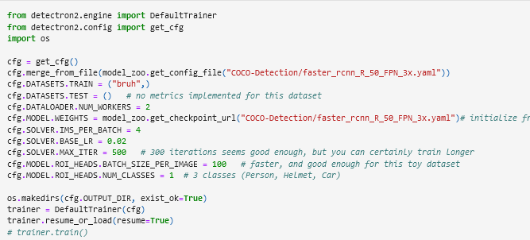
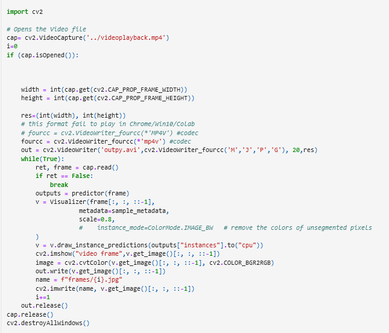

# Detection using Detectron 2

Detectron2 is Facebook AI Research's next generation library that provides state-of-the-art detection and segmentation algorithms. It is the successor of [Detectron](https://github.com/facebookresearch/Detectron/) and [maskrcnn-benchmark](https://github.com/facebookresearch/maskrcnn-benchmark/). It supports a number of computer vision research projects and production applications in Facebook.

Our Repository [URL](https://github.com/kunal266/raspberyy_pi_detection) 

To understand the working of Detectron2 in depth, you can refer to the article [here](https://medium.com/@hirotoschwert/digging-into-detectron-2-47b2e794fabd)

The training and testing pipeline of our project is available as a Jupyter notebook [here](https://github.com/kunal266/raspberyy_pi_detection/blob/master/detectron2/monkey.ipynb). 

1. Installing necessary requirements for Detectron2, followed by Detectron2 itself.

   

2. Create a Detectron dataset using the dataset we have already generated using VOTT to COCO format using any online tool like Roboflow.

   

3. Configure the Detectron instance and use the created dataset as Train data in the model.

   

4. This block of code takes a video as an input, goes through it frame by frame, detects and draws the bounding boxes of monkeys in it using the Detectron model and saves it frame by frame.

   

### The training and testing is therefore completed.

