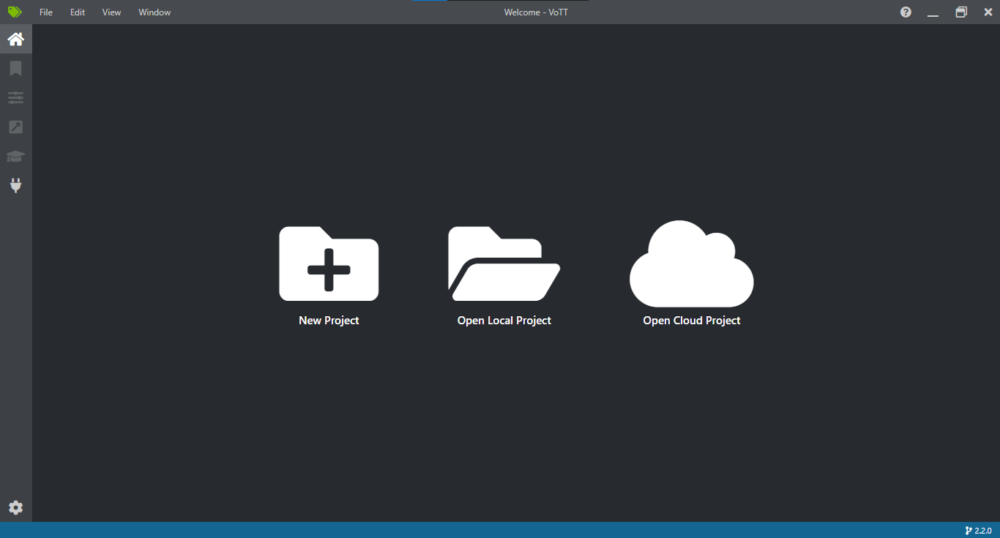
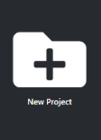
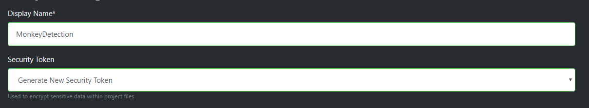
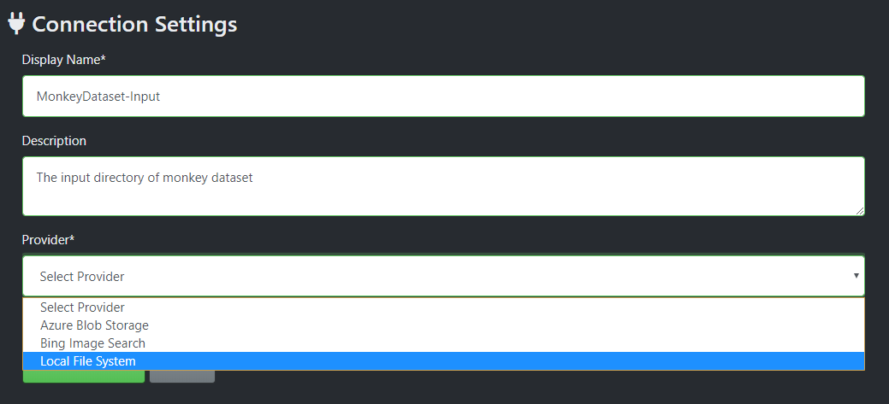
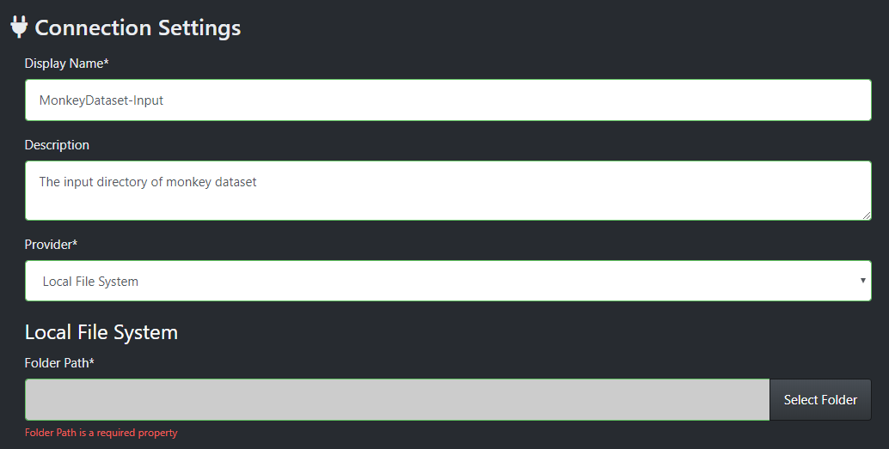
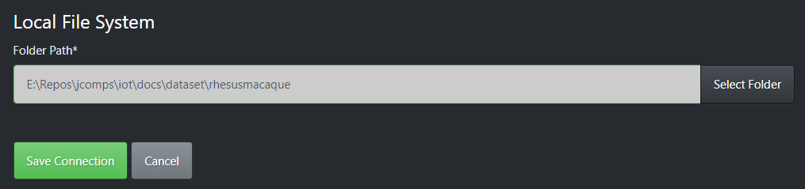
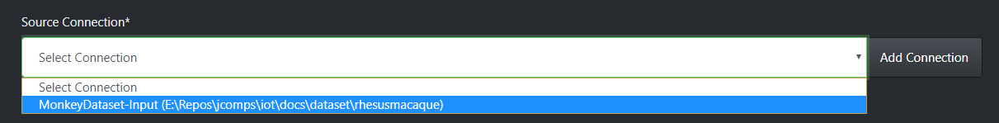
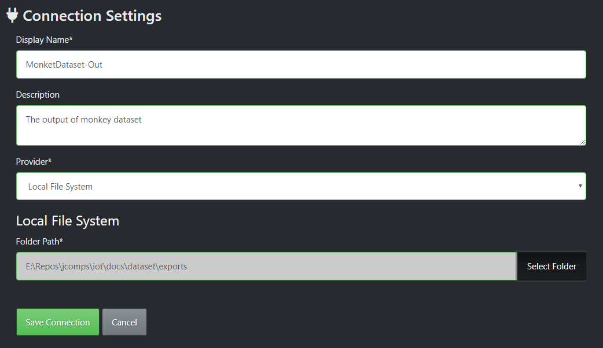
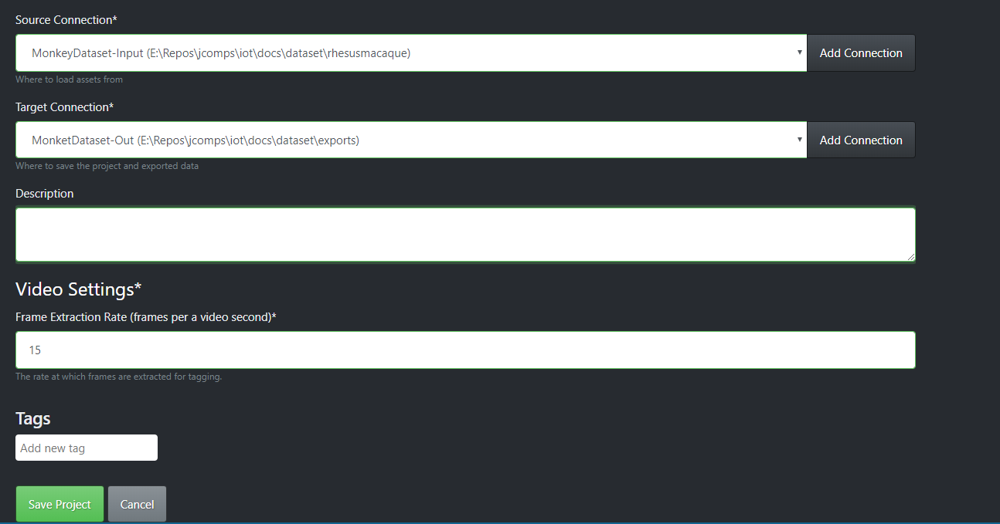

# VOTT Usage

VOTT is an open source computer vision annotation tool made by Microsoft. It provides a GUI interface to load your dataset and annotate them using classes. At the end of annotation, you can export it to any standard format of annotations used by Object Detection pipelines. 

Link to the repo : [VoTT](https://github.com/Microsoft/VoTT) 

## Installation

1. You can download the VOTT installer for your operating system [here](https://github.com/Microsoft/VoTT/releases).

2. Once downloaded, install VOTT on your system and run the installer. Wait for VOTT to finish installing.

3. Once it is finished installing, VOTT automatically opens a new window

   

## Creation of new project

1. Click on new project

   

2. Enter the "Display Name" and let the "Security Token" option be as it is.

    

3. "Source Connection" and "Destination Connection" represent that places to get the data and save the data to. We will be using our local file system for the purpose.

   

4. Click on "Add Connection". Fill in name and description and select "Local File System" from the dropdown. 

   

5. Once selected, click on "Select Folder" button.

   

6. Select path of your folder. The folder is required to only contain images that you want to annotate, no extra files.

   

7. Press "Save Connection" and a prompt appears, confirming the save.

    

8. Coming back to the page on step 3, we can now select out new connection as source.

   

9. Creating a connection for output as well.

   

10. Select this as "Target Connection". Leave the rest of the setting unchanged.

11. Click on "Save Project". We are brought to the project window.

## Tagging

