# VOTT Usage

VOTT is an open source computer vision annotation tool made by Microsoft. It provides a GUI interface to load your dataset and annotate them using classes. At the end of annotation, you can export it to any standard format of annotations used by Object Detection pipelines. 

Link to the repo : [VoTT](https://github.com/Microsoft/VoTT) 

## Installation

1. You can download the VOTT installer for your operating system [here](https://github.com/Microsoft/VoTT/releases).

2. Once downloaded, install VOTT on your system and run the installer. Wait for VOTT to finish installing.

3. Once it is finished installing, VOTT automatically opens a new window

   

## Creation of new project

1. Click on new project

   

2. Enter the "Display Name" and let the "Security Token" option be as it is.

    

3. "Source Connection" and "Destination Connection" represent that places to get the data and save the data to. We will be using our local file system for the purpose.

   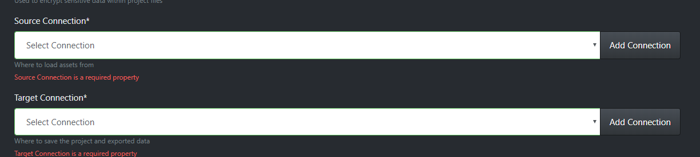

4. Click on "Add Connection". Fill in name and description and select "Local File System" from the dropdown. 

   

5. Once selected, click on "Select Folder" button.

   

6. Select path of your folder. The folder is required to only contain images that you want to annotate, no extra files.

   

7. Press "Save Connection" and a prompt appears, confirming the save.

   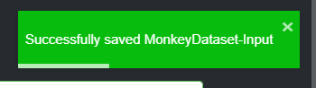 

8. Coming back to the page on step 3, we can now select out new connection as source.

   

9. Creating a connection for output as well.

   

10. Select this as "Target Connection". Leave the rest of the setting unchanged.

11. Click on "Save Project". We are brought to the project window.

## Tagging

VOTT supports tagging for the purpose of multi-class object detection as well as single class. For the scope of this project, we need to detect just a single class, monkey. But I'll demonstrate multi class selection as well.

1. On completing the setup of a project, we are brought to this window.

   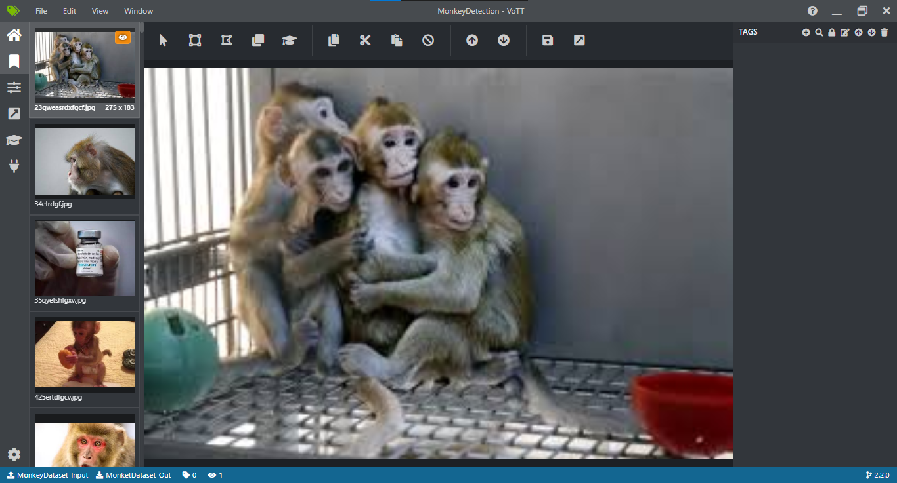

2. On the top right, we have the "TAGS" pane

   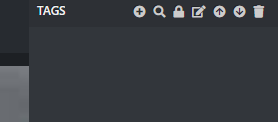

   Here, we can click on "+" to create a new tag. Let's make a tag, called "monkey".

3. The created tag has a colour to help differentiate it from others on the image.

   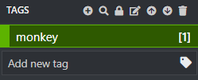

4. Once the tag is created, draw a box on the image, by (click, drag and release) of the mouse. As you can see, it is initially set to gray as it does not have a class assigned to it.

   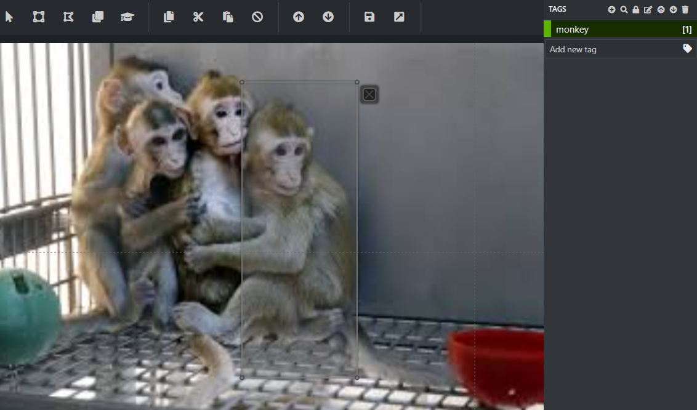

5. Now, click on "monkey" on the right pane and the tag gets assigned to the box. You can see that the box got the colour of the tag.

   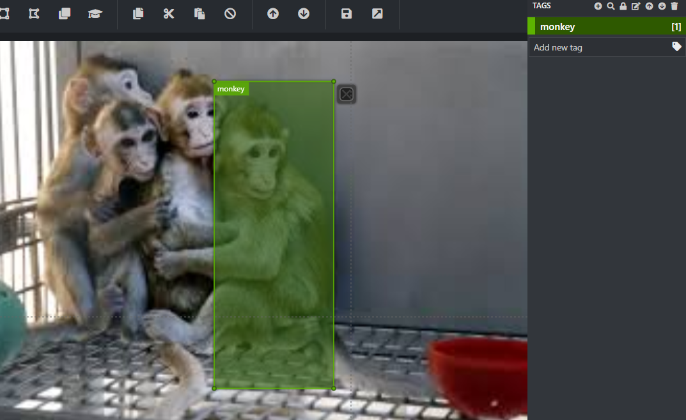

6. Keep doing this for all monkeys in all the images.

   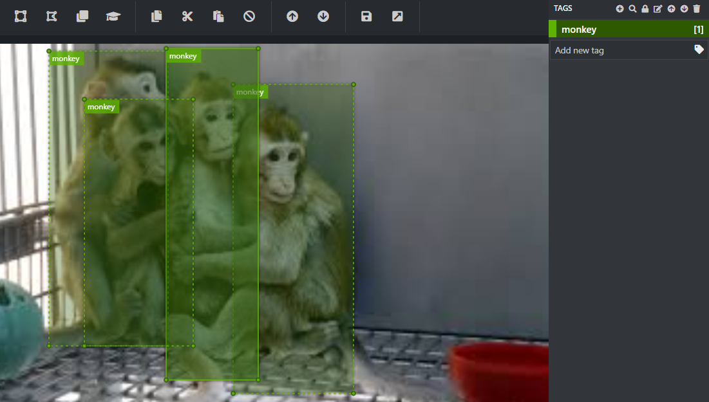

7. Once done, we can save and export our work.

   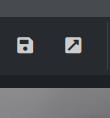

8. The default export is set to VOTT JSON format. But usually object detection models use other formats. To get those,  select the export button (4th from top) on the left sidebar.

   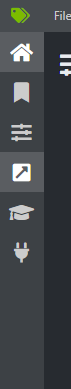

9. Select format in the "Provider Dropdown"

   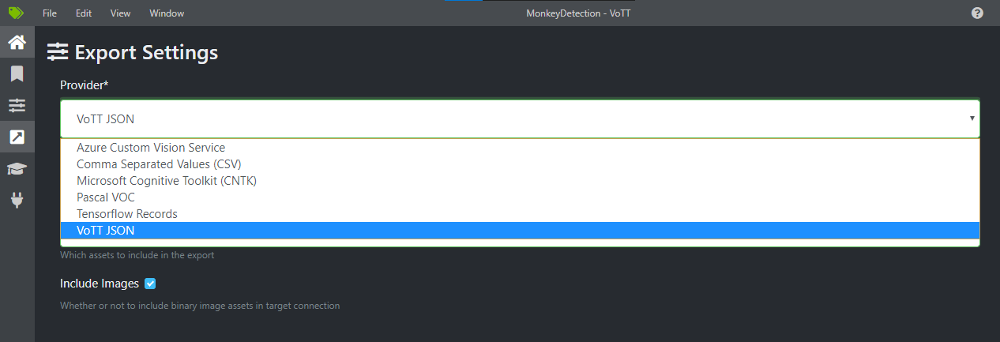

10. Select settings based on require and select "Save Export Settings"

11. Once saved, we can return to the window in Step 6 and click the export icon. We can see the exported dataset.

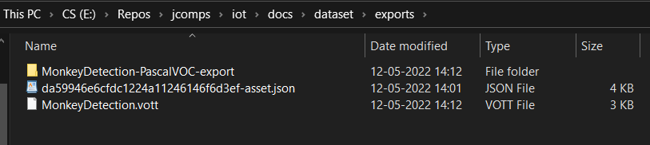

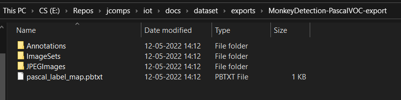

### With this, the dataset generation is completed.

